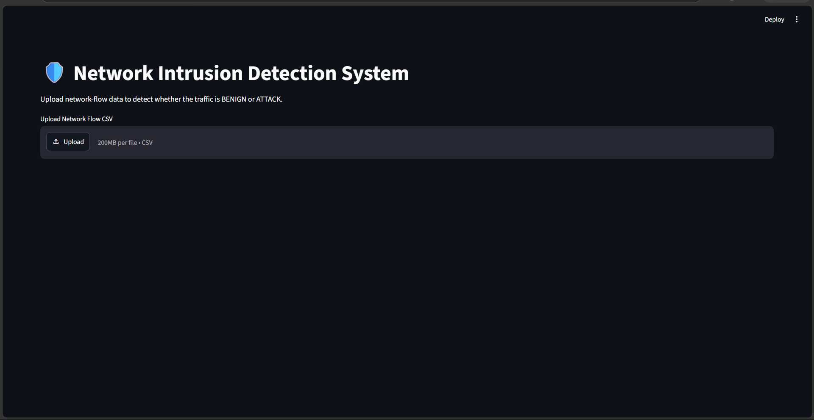
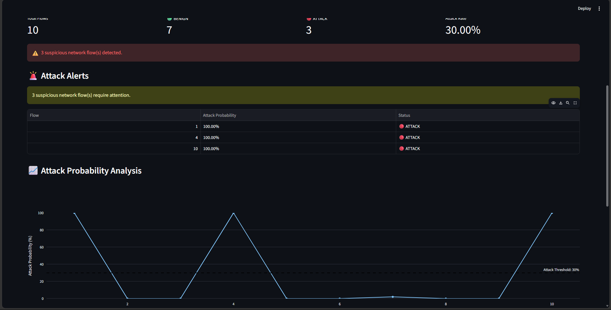
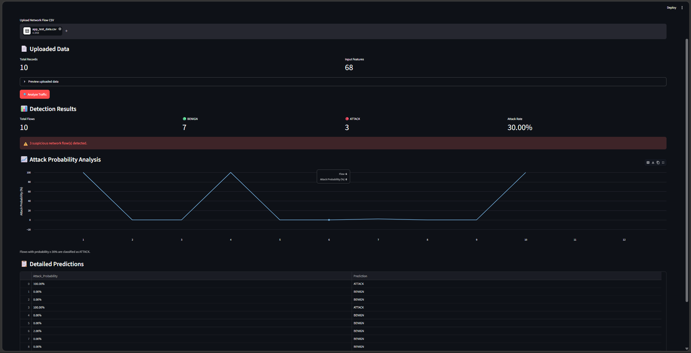

# 🛡️ Cyber Threat Detection Using Machine Learning

A machine-learning-based Network Intrusion Detection System (NIDS) that analyzes network-flow data and identifies potentially malicious traffic using a Random Forest classifier.

The project includes an end-to-end machine learning pipeline, model evaluation, threshold optimization, input validation, and a Streamlit-based web application for real-world prediction.

---

## 📌 Project Overview

Cybersecurity systems need to identify malicious network activity quickly and accurately.

This project develops a machine learning solution that classifies network traffic into:

- **BENIGN** — normal network traffic
- **ATTACK** — potentially malicious network traffic

The final system uses a **Random Forest Classifier** trained on 68 network-flow features.

A probability threshold of **0.30** was selected as the final operational threshold to provide a strong balance between detecting attacks and limiting false positives.

---

## 🎯 Objectives

The main objectives of this project are:

- Analyze network-flow data
- Clean and prepare the dataset
- Perform exploratory data analysis
- Build machine learning classification models
- Compare model performance
- Analyze important network features
- Perform cross-validation
- Analyze individual attack types
- Optimize the attack probability threshold
- Save and reload the trained model
- Build a reusable prediction module
- Develop a Streamlit web application
- Validate uploaded network data
- Generate downloadable prediction reports

---

## 📊 Dataset

The project uses network-flow data containing approximately **290,947 records** and **70 columns**.

After separating the target variable:

- **Features:** 68
- **Target:** Binary attack/benign classification
- **Records:** 290,947

The dataset contains different types of network traffic and attack categories, including:

- BENIGN
- DDoS
- DoS Hulk
- PortScan
- DoS GoldenEye
- FTP-Patator
- DoS slowloris
- DoS Slowhttptest
- SSH-Patator
- Bot
- Web Attack - Brute Force
- Web Attack - XSS
- Web Attack - SQL Injection
- Infiltration
- Heartbleed

---

## 🔬 Machine Learning Workflow

The project follows an end-to-end machine learning workflow:

```text
Raw Network Data
       ↓
Data Cleaning
       ↓
Exploratory Data Analysis
       ↓
Feature Preparation
       ↓
Train/Test Split
       ↓
Feature Scaling
       ↓
Logistic Regression Baseline
       ↓
Random Forest
       ↓
Model Evaluation
       ↓
Cross-Validation
       ↓
Feature Importance Analysis
       ↓
Attack-Type Analysis
       ↓
Probability Analysis
       ↓
Threshold Optimization
       ↓
Final Random Forest Model
       ↓
Model Serialization
       ↓
Prediction Module
       ↓
Streamlit Application

```

---

## 📈 Final Model Performance

The final binary Random Forest model uses an operational attack probability threshold of **0.30**.

| Metric    |      Score |
| --------- | ---------: |
| Accuracy  | **99.79%** |
| Precision | **99.38%** |
| Recall    | **99.59%** |
| F1 Score  | **99.49%** |
| ROC-AUC   | **99.97%** |
| PR-AUC    | **99.95%** |

### Confusion Matrix

```text
                  Predicted
                 BENIGN  ATTACK

Actual BENIGN     46298     73
Actual ATTACK        48  11771

```

---

## 🎯 Threshold Optimization

Instead of relying only on the default classification threshold of 0.50, multiple probability thresholds were evaluated.

| Threshold |   Accuracy |  Precision |     Recall |         F1 |
| --------: | ---------: | ---------: | ---------: | ---------: |
|      0.50 |     99.83% |     99.82% |     99.34% |     99.58% |
|      0.40 |     99.83% |     99.66% |     99.49% |     99.58% |
|  **0.30** | **99.79%** | **99.38%** | **99.59%** | **99.49%** |
|      0.20 |     99.72% |     98.88% |     99.74% |     99.31% |
|      0.10 |     99.51% |     97.80% |     99.84% |     98.81% |

The final operational threshold was selected as:

**0.30**

This threshold provides a strong balance between attack detection and false-positive control.

---

---

## 🔍 Feature Importance

The Random Forest model was used to identify the network-flow features that contributed most to classification.

| Feature                     | Importance |
| --------------------------- | ---------: |
| Bwd_Packet_Length_Mean      |     0.0958 |
| Bwd_Packet_Length_Std       |     0.0542 |
| Bwd_Packet_Length_Max       |     0.0525 |
| Average_Packet_Size         |     0.0463 |
| Avg_Bwd_Segment_Size        |     0.0462 |
| Subflow_Bwd_Bytes           |     0.0425 |
| Total_Length_of_Bwd_Packets |     0.0421 |
| Subflow_Fwd_Bytes           |     0.0335 |
| Total_Length_of_Fwd_Packets |     0.0317 |
| Packet_Length_Mean          |     0.0316 |

---

---

## 🖥️ Streamlit Application

The trained model is integrated into a Streamlit web application.

The application allows users to:

- Upload network-flow CSV files
- Validate the input data
- Check the required 68 features
- Analyze network traffic
- Classify flows as BENIGN or ATTACK
- View attack probabilities
- View attack statistics
- Identify suspicious network flows
- Visualize attack probabilities
- Download prediction results

### Application Workflow

```text
Upload CSV
     ↓
Input Validation
     ↓
68 Feature Verification
     ↓
Random Forest Prediction
     ↓
Attack Probability
     ↓
0.30 Threshold
     ↓
BENIGN / ATTACK
     ↓
Attack Alerts
     ↓
Visualization
     ↓
Download Results


```

---

## 📸 Application Preview

### Detection Dashboard



### Attack Probability Analysis



### Input Validation



---

---

## 📁 Project Structure

```text
cyber_threat_detection/
│
├── data/
│   ├── raw/
│   └── processed/
│
├── notebooks/
│   ├── 01_initial_eda.ipynb
│   └── models/
│       ├── final_random_forest.pkl
│       └── model_config.pkl
│
├── src/
│   ├── app.py
│   └── prediction.py
│
├── images/
│   ├── Dashboard.png
│   ├── chart.png
│   └── validation.png
│
├── test_prediction.py
├── requirements.txt
├── .gitignore
└── README.md
```

---

## ⚙️ Technologies Used

### Programming & Data

- Python
- Pandas
- NumPy

### Machine Learning

- Scikit-learn
- Random Forest
- Logistic Regression

### Visualization

- Matplotlib
- Seaborn
- Plotly

### Application

- Streamlit

### Model Management

- Joblib

### Development & Version Control

- Jupyter Notebook
- Git
- GitHub

---

---

## 🚀 Installation

### 1. Clone the repository

```bash
git clone https://github.com/mhdniihal/simpleaiprojects.git

cd cyber_threat_detection

python -m venv .venv

.venv\Scripts\activate

pip install -r requirements.txt
```

---

## ▶️ Running the Application

After installing the dependencies, start the Streamlit application with:

```bash
python -m streamlit run src/app.py
```

---

## 📥 Input Format

The application expects a CSV file containing the **68 network-flow features used during model training**.

### Input Requirements

The uploaded CSV must:

- Contain all 68 required features
- Use the correct feature names
- Contain numeric values for the model features
- Not contain missing values
- Not contain invalid or non-numeric values

The application automatically validates the uploaded CSV before running predictions.

### Validation

The system checks for:

- Missing required features
- Missing values
- Non-numeric values
- Invalid input data

If the uploaded file is invalid, prediction is stopped and a clear error message is displayed.

For example:

```text
❌ Invalid CSV: required features are missing.

Missing features:
Destination_Port
```

---

## 📤 Output

After analyzing the uploaded network-flow data, the application generates prediction results for each network flow.

The output includes:

- **Attack Probability** — probability that the flow belongs to the ATTACK class
- **Prediction** — final classification as BENIGN or ATTACK
- Original network-flow features

### Example

| Attack Probability | Prediction |
| -----------------: | ---------- |
|            100.00% | ATTACK     |
|              0.00% | BENIGN     |
|              2.00% | BENIGN     |
|            100.00% | ATTACK     |

### Operational Threshold

The final operational threshold is **0.30 (30%)**.

```text
Attack Probability ≥ 30%  →  ATTACK
Attack Probability < 30%  →  BENIGN
```

---

## 🔮 Future Improvements

The current system provides binary network threat detection using machine learning. The following improvements could make the system more advanced and suitable for larger-scale or real-time security environments:

- Real-time network traffic monitoring
- Live packet capture integration
- Multiclass attack identification in the Streamlit application
- Improved detection of rare attack categories
- SHAP-based model explainability
- Automated model retraining
- REST API deployment
- Cloud deployment
- Real-time security alerts
- Model performance and drift monitoring
- Authentication and role-based access

---

---

## ⚠️ Limitations

Although the model achieves strong performance on the evaluation dataset, there are several limitations to consider:

- The current system analyzes network-flow CSV files rather than live network traffic.
- Some attack categories contain very few samples, which makes reliable evaluation difficult.
- Minority attack classes such as Infiltration, Heartbleed, and Web Attack categories are more challenging to classify.
- The current Streamlit application performs binary classification as BENIGN or ATTACK.
- Model performance may decrease when applied to network traffic that differs significantly from the training data.
- The model should be periodically evaluated and retrained when network behavior or traffic patterns change.
- High accuracy on the evaluation dataset does not guarantee the same performance in a real-world production environment.

---

---

## 👨‍💻 Author

**Mohammed Nihal**

Bachelor of Computer Applications (BCA)

This project was developed as a machine learning and cybersecurity portfolio project, covering the complete workflow from network-flow data analysis and model development to deployment through a Streamlit application.
